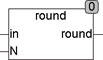

<!--
  Copyright (c) 2026 Hans Mühlbauer, Franz Höpfinger and others.

  This program and the accompanying materials are made available under the
  terms of the Eclipse Public License 2.0 which is available at
  https://www.eclipse.org/legal/epl-2.0

  SPDX-License-Identifier: EPL-2.0
-->

## ROUND

| | |
|:---|:---|
| **Type	Function** | REAL |
| **Input	IN** | REAL (input value) |
| **N** | integer (number of decimal places) |
| **Output** | REAL (rounded value) |
| | The function ROUND  rounds the input value IN to N digits. Follows the last digit  a digit  greater than 5 the last digit is rounded up. ROUND internally uses the standard function TRUNC() which converts the input value to an INTEGER type DINT. This may come as an overflow because DINT can store in maximum +/-2.14*10^9. The range of ROUND is therefore limited to +/- 2.14 * 10^9. |



**Example:**

```iecst
ROUND(3.555, 2) = 3.56
```
