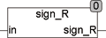

<!--
  Copyright (c) 2026 Hans Mühlbauer, Franz Höpfinger and others.

  This program and the accompanying materials are made available under the
  terms of the Eclipse Public License 2.0 which is available at
  https://www.eclipse.org/legal/epl-2.0

  SPDX-License-Identifier: EPL-2.0
-->

## Type	Function: BOOL

| | |
|:---|:---|
| **Input	IN** | REAL (input) |
| **Output** | BOOL (TRUE if the input is negative) |
| | The SIGN_R function returns TRUE if the input value is negative. The input values are of type REAL. |

