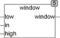

<!--
  Copyright (c) 2026 Hans Mühlbauer, Franz Höpfinger and others.

  This program and the accompanying materials are made available under the
  terms of the Eclipse Public License 2.0 which is available at
  https://www.eclipse.org/legal/epl-2.0

  SPDX-License-Identifier: EPL-2.0
-->

## WINDOW

| | |
|:---|:---|
| **Type	Function** | BOOL |
| **Input	LOW** | REAL (lower limit) |
| **IN** | REAL (input value) |
| **HIGH** | REAL (upper limit) |
| **Output** | BOOL (TRUE, if in < HIGH and in > LOW) |
| | The WINDOW function tests whether the input value is within the limits defined by the LOW and HIGH. |
| | WINDOW is exactly TRUE if IN < HIGH and IN > LOW. |

