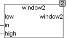

<!--
  Copyright (c) 2026 Hans Mühlbauer, Franz Höpfinger and others.

  This program and the accompanying materials are made available under the
  terms of the Eclipse Public License 2.0 which is available at
  https://www.eclipse.org/legal/epl-2.0

  SPDX-License-Identifier: EPL-2.0
-->

## Type	Function: BOOL

| | |
|:---|:---|
| **Input	LOW** | REAL (lower limit) |
| **IN** | REAL (input value) |
| **HIGH** | REAL (upper limit) |
| **Output** | BOOL (TRUE, if in <= HIGH and in >= LOW) |
| | The WINDow2 function tests whether the input value IN <= HIGH and IN >= LOW. In contrast to the function WINDOW which returns TRUE if the IN is within the limits LOW and HIGH WINDOW2 supplies FALSE if IN is outside the limits  LOW and HIGH . |

