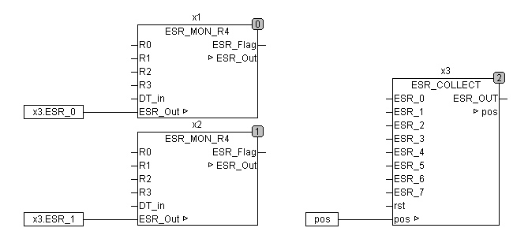

<!--
  Copyright (c) 2026 Hans Mühlbauer, Franz Höpfinger and others.

  This program and the accompanying materials are made available under the
  terms of the Eclipse Public License 2.0 which is available at
  https://www.eclipse.org/legal/epl-2.0

  SPDX-License-Identifier: EPL-2.0
-->

## ESR_COLLECT

| | |
|:---|:---|
| **Type** | Function module |
| **Input	 ESR_0.. 7** | [ESR_DATA](../Data Types/esr_data.md) (ESR inputs) |
| **RST** | BOOL (asynchronous reset input) |
| **Output	 ESR_OUT** | [ESR_DATA](../Data Types/esr_data.md)  (Array with the ESR protocol) |
| **IN/OUT	POS** | INT  (  Position  of  of latest  ESR protocol in the array) |
| | ESR_COLLECT collects ESR data from up to 8 ESR modules and stores the log in an array. The output POS indicates the position at which in the array ESR_OUT is currently the last message is ESR. Collects the module more than 64 messages so the messages are discarded and restarted at position 0. With the asynchronous reset input, the device can be reset at any time. By resetting, all the collected data will be deleted and the pointer is moved to -1. The module collects data in the output array ESR_OUT and moves POS the last position of the array that contains data. When there are no messages POS remains to -1. If the output data are read, the variable POS has to be set to -1, or if only readed a part POS can be set  to the last valid value. |
| | The following example demonstrates how ESR_COLLECT is connected with ESR modules. |
| **The output ESR_OUT is made up as follows** |  |
| **The ESR data includes the following** |  |
| **[ESR_DATA](../Data Types/esr_data.md) .TYP** | Data type, see table above |
| **[ESR_DATA](../Data Types/esr_data.md) .ADRESS** | up to 10 characters long  String  Identifier |
| **[ESR_DATA](../Data Types/esr_data.md) .DS** | Date stamp of type TIME DATA |
| **[ESR_DATA](../Data Types/esr_data.md) .TS** | Timestamp of type TIME (PLC  Timer  ) |
| **[ESR_DATA](../Data Types/esr_data.md) .DATA** | up to 8 bytes of data block |

| .TYPE | .ADRESS | .DS | .TS | .DATA [0..7] |  |
| --- | --- | --- | --- | --- | --- |
| 1 | Label | Date | TIME | Status, 1 Byte | ESR Error |
| 2 | Label | Date | TIME | Status, 1 Byte | ESR Status |
| 3 | Label | Date | TIME | Status, 1 Byte | ESR Debug |
| 10 | Label | Date | TIME | notused | Boolean input lowtransition |
| 11 | Label | Date | TIME | notused | Boolean input hightransition |
| 20 | Label | Date | TIME | Byte 0 - 3 Real Value | Real Valuechange |
