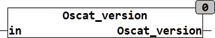

<!--
  Copyright (c) 2026 Hans Mühlbauer, Franz Höpfinger and others.

  This program and the accompanying materials are made available under the
  terms of the Eclipse Public License 2.0 which is available at
  https://www.eclipse.org/legal/epl-2.0

  SPDX-License-Identifier: EPL-2.0
-->

## Type	Function: DWORD

| | |
|:---|:---|
| **Input	IN** | BOOL (if TRUE the module provides the   release date) |
| **Output** | (Version of the library) |
| | OSCAT_VERSION iprovides if IN = FALSE the current version number as DWORD. If IN is set to TRUE then the  release  date of the current version as a DWORD is returned. |



**Example:**

```iecst
OSCAT_VERSION(FALSE) = 201 for version 2.60 DWORD_TO_DATE(OSCAT_VERSION (TRUE)) = 2008-1-1
```
