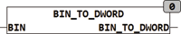

<!--
  Copyright (c) 2026 Hans Mühlbauer, Franz Höpfinger and others.

  This program and the accompanying materials are made available under the
  terms of the Eclipse Public License 2.0 which is available at
  https://www.eclipse.org/legal/epl-2.0

  SPDX-License-Identifier: EPL-2.0
-->

## Type	Function: DWORD

| | |
|:---|:---|
| **Input	BIN** | STRING (40) (Octal string) |
| **Output** | DWORD (output value) |
| | The function BIN_TO_DWORD converts a binary encoded string in a BYTE value. There, this method only binary characters are '0 'and '1' is interpreted, others in BIN occurring characters are ignored. |



**Example:**

```iecst
BIN_TO_DWORD ('11 ') result 3.
```
