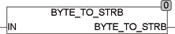

<!--
  Copyright (c) 2026 Hans Mühlbauer, Franz Höpfinger and others.

  This program and the accompanying materials are made available under the
  terms of the Eclipse Public License 2.0 which is available at
  https://www.eclipse.org/legal/epl-2.0

  SPDX-License-Identifier: EPL-2.0
-->

## Type	 Function  : STRING

| | |
|:---|:---|
| **Input	IN** | BYTE (input) |
| **Output** | STRING (8) (result STRING) |
| | BYTE_TO_STRB convert a byte into a fixed-length STRING. The output string is exactly 8 characters long and is the bitwise notation of the value of IN. The output string consists of the characters '0 'and '1'. The   least significant bit is right in the STRING. If a STRING is required with less than 8 characters, it can be truncated with the standard function RIGHT () accordingly. The call RIGHT(BYTE_TO_STRB (X),4) results in a STRING with four characters that correspond to the content of the lowest 4 bits of X. |



**Example:**

```iecst
BYTE_TO_STRB(3) = '00000011 '
```
