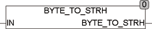

<!--
  Copyright (c) 2026 Hans Mühlbauer, Franz Höpfinger and others.

  This program and the accompanying materials are made available under the
  terms of the Eclipse Public License 2.0 which is available at
  https://www.eclipse.org/legal/epl-2.0

  SPDX-License-Identifier: EPL-2.0
-->

## BYTE_TO_STRH

| | |
|:---|:---|
| **Type	 Function** | STRING |
| **Input	IN** | BYTE (input) |
| **Output** | STRING(2) (result STRING) |
| | BYTE_TO_STRH converts a byte into a fixed-length STRING. The output string is exactly two characters long and is the hexadecimal notation of the value of IN. The output string consists of the characters '0 '.. '9' and 'A' .. 'F'. The  least significant sign is right in the STRING. |



**Example:**

```iecst
Example  :	BYTE_TO_STRH(15) = '0F'
```
