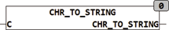

<!--
  Copyright (c) 2026 Hans Mühlbauer, Franz Höpfinger and others.

  This program and the accompanying materials are made available under the
  terms of the Eclipse Public License 2.0 which is available at
  https://www.eclipse.org/legal/epl-2.0

  SPDX-License-Identifier: EPL-2.0
-->

## Type	 Function  : STRING

| | |
|:---|:---|
| **Input	C** | Byte (input value) |
| **Output** | STRING (result STRING) |
| | CHR_TO_STRING forms a ASCII characters from a byte and returns it as a one-character string. |

