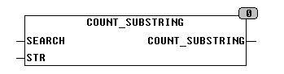

<!--
  Copyright (c) 2026 Hans Mühlbauer, Franz Höpfinger and others.

  This program and the accompanying materials are made available under the
  terms of the Eclipse Public License 2.0 which is available at
  https://www.eclipse.org/legal/epl-2.0

  SPDX-License-Identifier: EPL-2.0
-->

## COUNT_SUBSTRING

| | |
|:---|:---|
| **Type	Function** | INT |
| **Input	SEARCH** | STRING (string to be examined) |
| **STR** | STRING (search string) |
| **Output** | INT (number of localities) |
| | COUNT_SUBSTRING determined how many times a substring occurs in the string STR SEARCH. |

