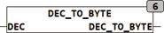

<!--
  Copyright (c) 2026 Hans Mühlbauer, Franz Höpfinger and others.

  This program and the accompanying materials are made available under the
  terms of the Eclipse Public License 2.0 which is available at
  https://www.eclipse.org/legal/epl-2.0

  SPDX-License-Identifier: EPL-2.0
-->

## Type	Function: BYTE

| | |
|:---|:---|
| **Input	DEC** | STRING(10) (decimal-encoded string) |
| **Output** | BYTE (output value) |
| | The function DEC_TO_BYTE converts a decimal encoded string into a byte value. Here only decimal characters '0 '.. '9' are interpreted, others in DEC occurring characters are ignored . |



**Example:**

```iecst
DEC_TO_BYTE('34 ') is 34.
```
