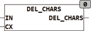

<!--
  Copyright (c) 2026 Hans Mühlbauer, Franz Höpfinger and others.

  This program and the accompanying materials are made available under the
  terms of the Eclipse Public License 2.0 which is available at
  https://www.eclipse.org/legal/epl-2.0

  SPDX-License-Identifier: EPL-2.0
-->

## Type	 Function  : STRING

| | |
|:---|:---|
| **Input	IN** | STRING (input) |
| **CX** | STRING (All characters which are to be deleted) |
| **Output** | STRING (result STRING) |
| | DEL_CHARS deletes all characters from a string which are contained in the string CX. |
| | CLEAN('Nr.1 23#', ' #ABCDEFG') = 'Nr.123' |

