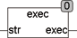

<!--
  Copyright (c) 2026 Hans Mühlbauer, Franz Höpfinger and others.

  This program and the accompanying materials are made available under the
  terms of the Eclipse Public License 2.0 which is available at
  https://www.eclipse.org/legal/epl-2.0

  SPDX-License-Identifier: EPL-2.0
-->

## Type	Function: STRING

| | |
|:---|:---|
| **Input	STR** | STRING (input STRING) |
| **Output** | STRING (result STRING) |
| | The function EXEC calculates mathematic expressions and results a string. The expression can only be a simple expression with an operator and without brackets. For errors, such as a divide by zero EXEC provides the return string 'ERROR'. |
| **The valid operators are** | +, - *, /, ^, SIN, COS, TAN, SQRT. |
| | REAL as numbers and integer numbers are allowed. |



**Example:**

```iecst
EXEC('3^2') = '9' EXEC('4-2') = '2'
```
