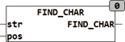

<!--
  Copyright (c) 2026 Hans Mühlbauer, Franz Höpfinger and others.

  This program and the accompanying materials are made available under the
  terms of the Eclipse Public License 2.0 which is available at
  https://www.eclipse.org/legal/epl-2.0

  SPDX-License-Identifier: EPL-2.0
-->

## Type	Function: INT

| | |
|:---|:---|
| **Input	STR** | STRING (input STRING) |
| **POS** | INT (start position) |
| **Output** | INT (pos of first character that is not a control character) |
| | FIND_CHAR searches the string STR starting at position POS and returns the position at which the first character is not a control character. Control characters are all characters whose value is less than 32 or 127. In examining the Global Setup EXTENDED_ASCII constant is considered. If EXTENDED_ASCII = TRUE the extended ASCII character-set to be considered in accordance with ISO 8859-1. Umlauts like Ä, Ö, Ü are considered only if the global constant   EXTENDED_ASCII = TRUE. If EXTENDED_ASCII = FALSE characters of the extended character set with a value > 127 interpreted as control characters. |

