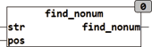

<!--
  Copyright (c) 2026 Hans Mühlbauer, Franz Höpfinger and others.

  This program and the accompanying materials are made available under the
  terms of the Eclipse Public License 2.0 which is available at
  https://www.eclipse.org/legal/epl-2.0

  SPDX-License-Identifier: EPL-2.0
-->

## Type	Function: INT

| | |
|:---|:---|
| **Input	STR** | STRING (String input) |
| **POS** | INT (position at which the search begins) |
| **Output** | INT (The first character that is not a number or point) |
| | The function FIND_NONUM searches STR from the starting position POS from left to right and returns the first position which is not a number. |
| | Numbers are the letters "0..9" and "." |



**Example:**

```iecst
FIND_NONUM('4+33',1) = 2
```
