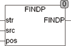

<!--
  Copyright (c) 2026 Hans Mühlbauer, Franz Höpfinger and others.

  This program and the accompanying materials are made available under the
  terms of the Eclipse Public License 2.0 which is available at
  https://www.eclipse.org/legal/epl-2.0

  SPDX-License-Identifier: EPL-2.0
-->

## Type	Function: INT

| | |
|:---|:---|
| **Input	STR** | STRING (String input) |
| **SRC** | STRING (search string) |
| **POS** | INT (from the position being sought) |
| **Output** | INT (position of the first letter of the found string) |
| | FINDP searches in a string STR starting at position POS for a string SRC. If SRC found in the string so the position of the first character of SRC in STR is returned. If the string starting at position POS is not found, an 0 is returned. If an empty string is specified as the search string, the module delivers the result 0. |



**Example:**

```iecst
FINDP('ein Fuchs ist ein Tier','ein',1) = 1; FINDP('ein Fuchs ist ein Tier','ein',2) = 15; FINDP('ein Fuchs ist ein Tier','ein',16) = 0;
```
