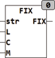

<!--
  Copyright (c) 2026 Hans Mühlbauer, Franz Höpfinger and others.

  This program and the accompanying materials are made available under the
  terms of the Eclipse Public License 2.0 which is available at
  https://www.eclipse.org/legal/epl-2.0

  SPDX-License-Identifier: EPL-2.0
-->

## Type	Function: STRING

| | |
|:---|:---|
| **Input	STR** | STRING (String input) |
| **L** | INT (fixed-length od output string) |
| **C** | BYTE (padding character when padding) |
| **M** | INT (mode for padding) |
| **Output** | STRING (string of fixed length N) |
| | FIX creates a string of fixed length N. The string STR at the input is truncated to the length N respective filled with the fill character C. If the string STR is shorter than the length L to be created, will the string be filled depending on M, with the fill character C. If M = 0, the padding at the end of the string is appended, if M = 1, the padding is attached the beginning and when M = 2, the string is centered between fill character. If the number of the necessary padding is odd and if M = 2, the fill at the end has a fill character more than at the beginning. The FIX function evaluates the Global Setup string_length constant and limits the maximum length L of the string to string_length. |

