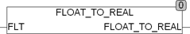

<!--
  Copyright (c) 2026 Hans Mühlbauer, Franz Höpfinger and others.

  This program and the accompanying materials are made available under the
  terms of the Eclipse Public License 2.0 which is available at
  https://www.eclipse.org/legal/epl-2.0

  SPDX-License-Identifier: EPL-2.0
-->

## Type	Function: REAL

| | |
|:---|:---|
| **Input	FLT** | STRING(20) (floating point) |
| **Output** | REAL (REAL value of the floating point) |
| | FLOAT_TO_REAL converts a string- floating point number into a data type REAL. While the conversion characters "." or ',' interpreted as a comma and 'E' or 'e' as the separator of the exponent. The characters '-0123456789' are evaluated and others in FLT occurring characters are ignored. |

