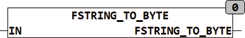

<!--
  Copyright (c) 2026 Hans Mühlbauer, Franz Höpfinger and others.

  This program and the accompanying materials are made available under the
  terms of the Eclipse Public License 2.0 which is available at
  https://www.eclipse.org/legal/epl-2.0

  SPDX-License-Identifier: EPL-2.0
-->

## Type	Function: BYTE

| | |
|:---|:---|
| **Input	IN** | STRING(12) (String input) |
| **Output** | BYTE (Byte value) |
| **FSTRING_TO_BYTE converts a formatted string into a byte value. It supports following input formats** |  |
| | 2#0101 (binary), 8#345 (octal), 16#2a33 (hexadecimal) and 234 (decimal). |

