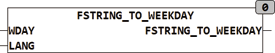

<!--
  Copyright (c) 2026 Hans Mühlbauer, Franz Höpfinger and others.

  This program and the accompanying materials are made available under the
  terms of the Eclipse Public License 2.0 which is available at
  https://www.eclipse.org/legal/epl-2.0

  SPDX-License-Identifier: EPL-2.0
-->

## Type	Function: INT

| | |
|:---|:---|
| **Input	WDAY** | STRING(20) (String input) |
| **LANG** | INT (language) |
| **Output** | INT (weekday) |
| | FSTRING_TO_WEEKDAY decodes a weekday in the form 'MO' to an integer, 1 = MO ... 7 = Sun. For the analysis the first two letters of the string WDAY are evaluated, all others are ignored. If the string contains spaces they will be removed. The days of the week can be present in both upper-or lowercase. Since the function evaluates only the first two characters, the weekdays may also be spelled out (Monday) format. |
| | Mo = 1; Di, Tu = 2; We, Mi = 3; Th, Do = 4; Fr = 5; Sa = 6; So, Su = 7 |
| | As an alternative form, the weekday can be specified as number 1..7. LANG specifies the used language, 1 = English, 2 = German, 0 = defined default language in the Setup. |

