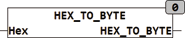

<!--
  Copyright (c) 2026 Hans Mühlbauer, Franz Höpfinger and others.

  This program and the accompanying materials are made available under the
  terms of the Eclipse Public License 2.0 which is available at
  https://www.eclipse.org/legal/epl-2.0

  SPDX-License-Identifier: EPL-2.0
-->

## Type	Function: BYTE

| | |
|:---|:---|
| **Input	HEX** | STRING(5) (hex string) |
| **Output** | BYTE (output value) |
| | The function converts a hexadecimal string HEX_TO_BYTE in a BYTE value. Here only hexadecimal characters  '0'..'9', 'a..f' and 'A'.. 'F' are interpreted, others occurring in HEX characters are ignored. |



**Example:**

```iecst
HEX_TO_BYTE('FF') is 255.
```
