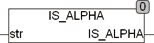

<!--
  Copyright (c) 2026 Hans Mühlbauer, Franz Höpfinger and others.

  This program and the accompanying materials are made available under the
  terms of the Eclipse Public License 2.0 which is available at
  https://www.eclipse.org/legal/epl-2.0

  SPDX-License-Identifier: EPL-2.0
-->

## IS_ALPHA

| | |
|:---|:---|
| **Type	Function** | BOOL |
| **Input	STR** | STRING (String input) |
| **Output** | BOOL (TRUE if STR contains only letters) |
| | IS_ALPHA tests whether the string STR contains only letters. If an incorrect, non-alphanumeric character is found the function returns FALSE. If only letters are included in STR is the result of TRUE. Letters are the characters A..Z and a..z. In examining the Global Setup EXTENDED_ASCII constant is considered. If EXTENDED_ASCII = TRUE the extended ASCII character-set to be considered in accordance with ISO 8859-1. Umlauts like Ä, Ö, Ü are considered only if the global constant   EXTENDED_ASCII = TRUE. |

