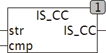

<!--
  Copyright (c) 2026 Hans Mühlbauer, Franz Höpfinger and others.

  This program and the accompanying materials are made available under the
  terms of the Eclipse Public License 2.0 which is available at
  https://www.eclipse.org/legal/epl-2.0

  SPDX-License-Identifier: EPL-2.0
-->

## IS_CC

| | |
|:---|:---|
| **Type	Function** | BOOL |
| **Input	STR** | STRING (String input) |
| **CMP** | STRING (comparison characters) |
| **Output** | BOOL (TRUE if STR contains only those listed in the STRING CMP |
| | contains) |
| | IS_CC tests whether the string in STR only the in STR listed characters are included. If another character is found the function returns FALSE. |



**Example:**

```iecst
IS_CC('3.14', '0123456789.') = TRUE IS_CC('-3.14', '0123456789.') = FALSE
```
