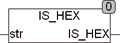

<!--
  Copyright (c) 2026 Hans Mühlbauer, Franz Höpfinger and others.

  This program and the accompanying materials are made available under the
  terms of the Eclipse Public License 2.0 which is available at
  https://www.eclipse.org/legal/epl-2.0

  SPDX-License-Identifier: EPL-2.0
-->

## IS_HEX

| | |
|:---|:---|
| **Type	Function** | BOOL |
| **Input	STR** | STRING (String input) |
| **Output** | BOOL (TRUE if STR contains only hexadecimal) |
| | IS_HEX tests whether the string STR contains only hexadecimal characters are. If another character is found the function returns FALSE. If in STR are only hexadecimal characters included, the function returns TRUE. The hexadecimal character are characters with the decimal code 0..9, a..f. and A..F. |

