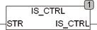

<!--
  Copyright (c) 2026 Hans Mühlbauer, Franz Höpfinger and others.

  This program and the accompanying materials are made available under the
  terms of the Eclipse Public License 2.0 which is available at
  https://www.eclipse.org/legal/epl-2.0

  SPDX-License-Identifier: EPL-2.0
-->

## ISC_CTRL

| | |
|:---|:---|
| **Type	Function** | BOOL |
| **Input	IN** | BYTE (characters) |
| **Output** | BOOL (TRUE IN a sign is 0..9) |
| | ISC_CTRL tests whether a sign IN is a control character, if IN is a controll character, the function returns TRUE, if not the function returns FALSE. Control characters are all characters with code < 32 or 127. |

