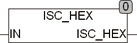

<!--
  Copyright (c) 2026 Hans Mühlbauer, Franz Höpfinger and others.

  This program and the accompanying materials are made available under the
  terms of the Eclipse Public License 2.0 which is available at
  https://www.eclipse.org/legal/epl-2.0

  SPDX-License-Identifier: EPL-2.0
-->

## ISC_HEX

| | |
|:---|:---|
| **Type	Function** | BOOL |
| **Input	IN** | BYTE (characters) |
| **Output** | BOOL (TRUE IN a sign is 0..9) |
| | ISC_HEX tests whether a sign IN is a hex character, If IN is a sign 0..9, A..F, a..f the function returns TRUE if the function returns FALSE. |
| | The signs are 0..9 are the codes (48..57) |
| | The characters A..F are the codes (65..70) |
| | The characters a..f are the codes (97..102) |

