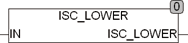

<!--
  Copyright (c) 2026 Hans Mühlbauer, Franz Höpfinger and others.

  This program and the accompanying materials are made available under the
  terms of the Eclipse Public License 2.0 which is available at
  https://www.eclipse.org/legal/epl-2.0

  SPDX-License-Identifier: EPL-2.0
-->

## Type	Function: BOOL

| | |
|:---|:---|
| **Input	IN** | BYTE (characters) |
| **Output** | Type |
| | ISC_LOWER tests whether a sign IN is a lowercase letter, If IN is a lower case the function returns TRUE, else the function returns FALSE. In examining the Global Setup EXTENDED_ASCII constant is considered. If EXTENDED_ASCII = TRUE the extended ASCII character-set to be considered in accordance with ISO 8859-1. |
| **The following  Table  discusses the character codes** |  |

| Code | EXTENDED_ASCII = TRUE | EXTENDED_ASCII = FASLE |
| --- | --- | --- |
| 0..96, 123..223, 247, 255 | FALSE | FALSE |
| 97..122 | TRUE | TRUE |
| 224..246 | TRUE | FALSE |
| 248..254 | TRUE | FALSE |
