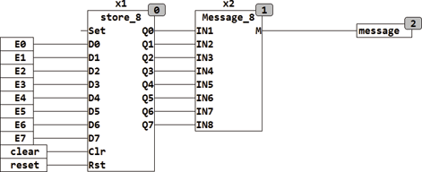

<!--
  Copyright (c) 2026 Hans Mühlbauer, Franz Höpfinger and others.

  This program and the accompanying materials are made available under the
  terms of the Eclipse Public License 2.0 which is available at
  https://www.eclipse.org/legal/epl-2.0

  SPDX-License-Identifier: EPL-2.0
-->

## MESSAGE_8

| | |
|:---|:---|
| **Type** | Function module |
| **Input	IN1..IN8** | BOOL (select inputs) |
| **Output	M** | STRING (String output) |
| | MESSAGE_8 generates an output of 8 messages on M. If none of the inputs IN1..IN8 are TRUE,the output to M is an empty string, otherwise one of the stored in S1..S8 messages is passed. The module passes the message with the highest priority. IN1 has the highest priority and IN8 the lowest. MESSAGE_8 can be used in conjunction with the module STORE_8 to save and view events. |
| | In the following example, up to 8 fault events (E0..E7) |
| | are stored, and in each case the highest priority message is shown at the output of M MESSAGE_8. With the CLEAR input  last message can be deleted by triggering and the next pending message is passed. WITH the RESET input  all pending error messages can be cleared. |
| **Setup	S1..S8** | STRING(default message) |

