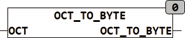

<!--
  Copyright (c) 2026 Hans Mühlbauer, Franz Höpfinger and others.

  This program and the accompanying materials are made available under the
  terms of the Eclipse Public License 2.0 which is available at
  https://www.eclipse.org/legal/epl-2.0

  SPDX-License-Identifier: EPL-2.0
-->

## OCT_TO_BYTE

| | |
|:---|:---|
| **Type	Function** | BYTE |
| **Input	OCT** | STRING (10) (Octal string) |
| **Output** | BYTE (output value) |
| | The function OCT_TO_BYTE converts an octal encoded string into a byte value. Only the octal characters are '0 '..'7' are interpreted, others in HEX  occurring characters are ignored. |



**Example:**

```iecst
OCT_TO_BYTE('11') results 9.
```
