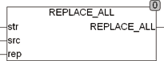

<!--
  Copyright (c) 2026 Hans Mühlbauer, Franz Höpfinger and others.

  This program and the accompanying materials are made available under the
  terms of the Eclipse Public License 2.0 which is available at
  https://www.eclipse.org/legal/epl-2.0

  SPDX-License-Identifier: EPL-2.0
-->

## REPLACE_ALL

| | |
|:---|:---|
| **Type	Function** | STRING |
| **Input	STR** | STRING (String input) |
| **SRC** | STRING (search string) |
| **REP** | STRING (String replacement) |
| **Output** | STRING (String output) |
| | REPLACE_ALL replaces all occurring strings SRC in the string STR with REP. An empty string SRC gives no results. |



**Example:**

```iecst
REPLACE_ALL('123BB456BB789BB','BB','/') = '123/456/789/' REPLACE_ALL('123BB456BB789BB','BB','') = '123456789'
```
