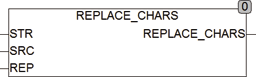

<!--
  Copyright (c) 2026 Hans Mühlbauer, Franz Höpfinger and others.

  This program and the accompanying materials are made available under the
  terms of the Eclipse Public License 2.0 which is available at
  https://www.eclipse.org/legal/epl-2.0

  SPDX-License-Identifier: EPL-2.0
-->

## REPLACE_CHARS

| | |
|:---|:---|
| **Type	Function** | STRING |
| **Input	STR** | STRING (String input) |
| **SRC** | STRING (search strings) |
| **REP** | STRING (surrogate) |
| **Output** | STRING (String output) |
| | REPLACE_CHARS replaces all the characters STR  in String SRC with the characters at the same place in REP. |



**Example:**

```iecst
REPLACE_CHARS('abc123', '0123456789', ABCDEFGHIJ') = 'abcABC'
```
