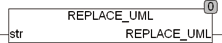

<!--
  Copyright (c) 2026 Hans Mühlbauer, Franz Höpfinger and others.

  This program and the accompanying materials are made available under the
  terms of the Eclipse Public License 2.0 which is available at
  https://www.eclipse.org/legal/epl-2.0

  SPDX-License-Identifier: EPL-2.0
-->

## REPLACE_UML

| | |
|:---|:---|
| **Type	Function** | STRING |
| **Input	STR** | STRING (String input) |
| **Output** | STRING (String output) |
| | REPLACE_UML replaces umlauts with a combination of two characters so that the result contains no more umlauts. The large and small letters are considered here. If a word is all upper case and is an umlaut is mentioned, this is replaced by a capital letter followed by a lowercase letter, in the case of a ß which has no capitals there will always be replaced with two small letters. If the function REPLACE_UML is used on a uppercase word, then it must be ensured using the function UPPERCASE() that all capital letters that the lower case are again converted to uppercase. |
| | Ä > Ae, Ö > Oe, Ü > Ue, ä > ae, ö > oe, ü > oe, ß > ss. |

