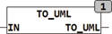

<!--
  Copyright (c) 2026 Hans Mühlbauer, Franz Höpfinger and others.

  This program and the accompanying materials are made available under the
  terms of the Eclipse Public License 2.0 which is available at
  https://www.eclipse.org/legal/epl-2.0

  SPDX-License-Identifier: EPL-2.0
-->

## Type	Function: STRING(2)

| | |
|:---|:---|
| **Input	IN** | BYTE (  Characters to be converted  ) |
| **Output** | STRING (2) (converted characters) |
| | TO_UML converts individual characters of the character set to greater than 127 in a combination of two letters. It is here the extended ASCII character set ISO 8859-1 (Latin1). |
| **It will be converted the following characters** |  |
| **Ä >> Ae** | ä >> ae	Ö >> Oe	ö >> oe	Ü >> Ue	ü >> ue |
| | ß >> ss |
| | All other characters are returned as a string with the character IN. |

