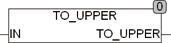

<!--
  Copyright (c) 2026 Hans Mühlbauer, Franz Höpfinger and others.

  This program and the accompanying materials are made available under the
  terms of the Eclipse Public License 2.0 which is available at
  https://www.eclipse.org/legal/epl-2.0

  SPDX-License-Identifier: EPL-2.0
-->

## Type	Function: BYTE

| | |
|:---|:---|
| **Input	IN** | BYTE (  Characters to be converted  ) |
| **Output** | BYTE (converted characters) |
| | To_upper converts some characters to uppercase. During conversion, the Global Setup EXTENDED_ASCII constant is considered. If EXTENDED_ASCII = TRUE, all characters of the extended ASCII character set to be considered in accordance with ISO 8859-1. |
| **The following  Table  discusses the conversion code** |  |

| Code | EXTENDED_ASCII = TRUE | EXTENDED_ASCII = FALSE |
| --- | --- | --- |
| 0..64 | 0..64 | 0..64 |
| 65..90 | 97..122 | 97..122 |
| 91..191 | 91..191 | 91..191 |
| 192..214 | 224..246 | 192..214 |
| 215 | 215 | 215 |
| 216..222 | 248..254 | 216..254 |
| 223..255 | 223..255 | 223..255 |
