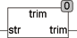

<!--
  Copyright (c) 2026 Hans Mühlbauer, Franz Höpfinger and others.

  This program and the accompanying materials are made available under the
  terms of the Eclipse Public License 2.0 which is available at
  https://www.eclipse.org/legal/epl-2.0

  SPDX-License-Identifier: EPL-2.0
-->

## Type	Function: STRING

| | |
|:---|:---|
| **Input	STR** | STRING (String input) |
| **Output** | STRING (STR without spaces) |
| | The TRIM function removes all spaces from STR. |



**Example:**

```iecst
TRIM('find BX12') = 'findBX12'
```
