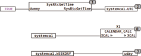

<!--
  Copyright (c) 2026 Hans Mühlbauer, Franz Höpfinger and others.

  This program and the accompanying materials are made available under the
  terms of the Eclipse Public License 2.0 which is available at
  https://www.eclipse.org/legal/epl-2.0

  SPDX-License-Identifier: EPL-2.0
-->

## CALENDAR_CALC

| | |
|:---|:---|
| **Type** | Function module |
| **Input	SPE** | BOOL (TRUE calculates the current sun position) |
| **I / O	XCAL** | [CALENDAR](../Data Types/calendar.md) (external variables) |
| **HOLIDAYS** | [HOLIDAY_DATA](../Data Types/holiday_data.md) (holiday list) |
| | CALENDAR_CALC automatically calculates all the values in a  [CALENDAR](../Data Types/calendar.md) structure based on the value of the type UTC in the structure. XCAL is a Pointer an external or global variable of type [CALENDAR](../Data Types/calendar.md). CALENDAR_CALC can thus deliver calendar values based on the structure XCAL throughout the module. CALENDAR_CALC determines at each change of the value UTC in XCAL automatically all other values in the structure. Alone the value of UTC in a structure must be fed by the RTC module. The definition of the structured type [CALENDAR](../Data Types/calendar.md) you can find in section data structures. The continuous calculation of the sun position can weigh heavily on a PLC without FPU, which is why the current sun position is calculated only once every 25 seconds if SPE = TRUE. This corresponds to an accuracy of 0.1 degrees which is quite sufficient for normal applications. If SPE is FALSE, the position of the sun is not calculated. By an external array HOLIDAYS of type HOLYDAY_DATA, the user can specify specific holidays according to his needs, for more information on the definition of public holidays see the module data structures. |
| | If several structures of the type [CALENDAR](../Data Types/calendar.md) are required (for example, or various local and UTC times) then more modules CALENDAR_CALC can be used with different structures of TYPE [CALENDAR](../Data Types/calendar.md) in accordance . |
| | The following example shows how the module SYSRTCGETTIME reads the RTC of the CPU and writes the current time in SYSTEMCAL.UTC. CALENDAR_CALC checks every cycle if the value in .UTC has changed and if so it calculates the other values of the structure automatically. The output WDAY shows how the structure reads data for further processing. CALENDAR_CALC accounts of the setup data from the data structure (OFFSET DST_EN, LONGITUDE, LATITUDE). |
| | In the external array HOLIDAYS up to 30 holidays can be defined. For examples, see the description of the data type [HOLIDAY_DATA](../Data Types/holiday_data.md). This array of [HOLIDAY_DATA](../Data Types/holiday_data.md) must be defined outside of the module and be pre-assigned as a variable with the holiday dates. |

