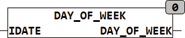

<!--
  Copyright (c) 2026 Hans Mühlbauer, Franz Höpfinger and others.

  This program and the accompanying materials are made available under the
  terms of the Eclipse Public License 2.0 which is available at
  https://www.eclipse.org/legal/epl-2.0

  SPDX-License-Identifier: EPL-2.0
-->

## Type	Function: INT

| | |
|:---|:---|
| **Input	IDATE** | DATE (date) |
| **Output** | INT (month in the year of the input date) |
| | The function calculates the DAY_OF_WEEK week from the date of receipt IDATE. |
| | Monday = 1 .. Sunday = 7 The calculation is done in accordance with ISO8601. |



**Example:**

```iecst
DAY_OF_WEEK(D#2007-1-8) = 1
```
