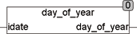

<!--
  Copyright (c) 2026 Hans Mühlbauer, Franz Höpfinger and others.

  This program and the accompanying materials are made available under the
  terms of the Eclipse Public License 2.0 which is available at
  https://www.eclipse.org/legal/epl-2.0

  SPDX-License-Identifier: EPL-2.0
-->

## Type	Function: INT

| | |
|:---|:---|
| **Input	IDATE** | DATE (date) |
| **Output** | INT (day of the year of input date) |
| | The DAY_OF_YEAR function calculates the day of the year from the input date IDATE. Leap years are taken into account according to the Gregorian calendar. The function is defined for the years 1970 - 2099. |



**Example:**

```iecst
DAY_OF_YEAR(31.12.2007) = 365 DAY_OF_YEAR(31.12.2008) = 366
```
