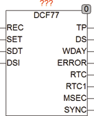

<!--
  Copyright (c) 2026 Hans Mühlbauer, Franz Höpfinger and others.

  This program and the accompanying materials are made available under the
  terms of the Eclipse Public License 2.0 which is available at
  https://www.eclipse.org/legal/epl-2.0

  SPDX-License-Identifier: EPL-2.0
-->

## Type	Function module

| | |
|:---|:---|
| **Input	REC** | BOOL (input for the DCF77 receiver) |
| **SET** | BOOL (Asynchronous SET input) |
| **[SDT](../Data Types/sdt.md)** | DT (initial value for RTC) |
| **DSI** | BOOL (DST in) |
| **Output	TP** | BOOL ( pulse for setting downstream clock) |
| **DS** | BOOL (TRUE if daylight saving time is) |
| **WDAY** | INT (weekday) |
| **ERROR** | BOOL (TRUE, if REC supplies no signal) |
| **RTC** | DT (Synchronized Universal Time UTC) |
| **RTC1** | DT (Synchronized local time) |
| **MSEC** | INT (milliseconds from RTC and RTC1) |
| **SYNC** | BOOL (TRUE, when RTC is in sync with DCF) |
| **Setup	SYNC_TIMEOUT** | TIME (  Default = T#2m) |
| **Time_offset** | INT (time offset for RTC1,  Default  = 1 hour) |
| **DST_EN** | BOOL (daylight saving time for RTC1,  Default  = TRUE) |
| | The function DCF77 decodes the serial signal of DCF77 receiver and controls 2 internal clock RTC and RTC1, or via output TP external (downstream) watches. An output DS is TRUE if daylight saving time is. The output WDAY is the weekday (1 = Monday). The output ERROR is TRUE if no valid signal is received. The internal clocks continue to run anyway, also if they already synchronized. A   Another output SYNC indicates that  in  internal clocks are synchronized with DCF77 and gets FALSE if they  were synchronized by not less than the setup variable SYNC_TIMEOUT specified time. The internal clocks runs always with the accuracy of the SPS  Timers  further. By double-clicking the icon in the CFC editor other setup variables are defined. Here SYNC_TIMEOUT sets, after which time the output signal SYNC gets FALSE, if the internal clock RTC and RTC1 were not synchronized by DCF77. The variable time_offset determines the time difference between local time (RTC1) from the UTC.  Default  is 1 hour for CET (Central European Time). The variable TIME_OFFSET is of type INTEGER thus also time zones with negative offset (west of Greenwich) are possible. |
| | By DST_EN is determined whether RTC1 should automatically switch to summer time or not. The output MSEC extends the by RTC to RTC1 provided time to milliseconds. The [SDT](../Data Types/sdt.md) is used to put the internal clock RTC and RTC1 to a defined initial value, so that immediately after the start a valid time is available. During the first cycle date and time is copied from [SDT](../Data Types/sdt.md) to RTC and runs from the first cycle. If necessary, the internal CLOCK can be set always new with the asynchronous set input SET. However, it is overwritten again by a valid DCF77 signal after a cycle, unless the SET input remains TRUE. If a valid DCF77 signal was decoded, RTC and RTC1 is synchronized to the corresponding precise DCF77 time. At the input of [SDT](../Data Types/sdt.md) for example, the time from the information contained in the PLC Hardware Clock can be used. It must be ensured, that the DCF77 is called only if a valid time is already present in [SDT](../Data Types/sdt.md), the DCF77 reads this value only once in the first cycle, or at any time when the SET input is set to TRUE. |

