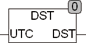

<!--
  Copyright (c) 2026 Hans Mühlbauer, Franz Höpfinger and others.

  This program and the accompanying materials are made available under the
  terms of the Eclipse Public License 2.0 which is available at
  https://www.eclipse.org/legal/epl-2.0

  SPDX-License-Identifier: EPL-2.0
-->

## Type	Function: BOOL

| | |
|:---|:---|
| **Input	UTC** | DATE_TIME (Universal Time) |
| **Output** | BOOL (TRUE if daylight saving time) |
| | The DST function checks whether daylight saving time is right now or not. It can be used to an existing non-DST enabled clock to switch to summer and winter in exact seconds. |
| **The function of DST switches on the last Sunday of March at 01** | 00 UTC (02:00 CET) to summer time (03:00 GMT) and on the last Sunday of October at 01:00 UTC (03:00 BST) to 02:00 CET back. The output of DST is TRUE if daylight saving time is. |
| **The summer time is calculated based on UTC (Universal Time). A calculation of location-time for daylight saving time is generally not possible because in the last Sunday of October, the hour of 2** | 00 a.m. to 3:00 a.m. PST or PDT there exists twice. The summer time will be changed in all countries of the EU since 1992, at the same second to world time. In Central Europe at 02:00, at 01:00 in England and Greece at 04:00. By using the world time calculation of daylight saving time for all European time zones is calculated correctly. |

