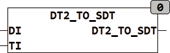

<!--
  Copyright (c) 2026 Hans Mühlbauer, Franz Höpfinger and others.

  This program and the accompanying materials are made available under the
  terms of the Eclipse Public License 2.0 which is available at
  https://www.eclipse.org/legal/epl-2.0

  SPDX-License-Identifier: EPL-2.0
-->

## Type	Function: [SDT](../Data Types/sdt.md)

| | |
|:---|:---|
| **Input	DI** | DATE (date) |
| **TI** | TOD (time of day) |
| **Output** | [SDT](../Data Types/sdt.md) (Structured date time value of type [SDT](../Data Types/sdt.md)) |
| | DT2_TO_SDT converts a date and time of day to day in a structured date type [SDT](../Data Types/sdt.md). |

