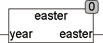

<!--
  Copyright (c) 2026 Hans Mühlbauer, Franz Höpfinger and others.

  This program and the accompanying materials are made available under the
  terms of the Eclipse Public License 2.0 which is available at
  https://www.eclipse.org/legal/epl-2.0

  SPDX-License-Identifier: EPL-2.0
-->

## Type	Function: DATE

| | |
|:---|:---|
| **Input	YEAR** | INT (year) |
| **Output** | DATE (date of Easter Sunday for the specified year) |
| | The function EASTER calculates for a given year, the date of Easter Sunday. Most religious holidays have a fixed distance from Easter, so that in the case that Easter is known for a year, these holidays can also be determined easily. EASTER is also used in the module HOLIDAY to calculate holidays. |

