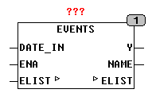

<!--
  Copyright (c) 2026 Hans Mühlbauer, Franz Höpfinger and others.

  This program and the accompanying materials are made available under the
  terms of the Eclipse Public License 2.0 which is available at
  https://www.eclipse.org/legal/epl-2.0

  SPDX-License-Identifier: EPL-2.0
-->

## EVENTS

| | |
|:---|:---|
| **Type** | Function module |
| **Input	Date_in** | DATE (input date) |
| **ENA** | BOOL (Enable Input) |
| **I / O	ELIST** | ARRAY [0.49] of [HOLIDAY_DATA](../Data Types/holiday_data.md) |
| **Output	Y** | BOOL (TRUE if date_in is an event) |
| **Name** | STRING(30) (name of today's event) |
| | The module EVENTS shows the output Y with TRUE special days and also provides the names of the events at the output NAME. EVENTS can also take into account events over several days. The array ELIST name, date and duration of events are set. |
| | In the external array ELIST can define up to 50 such events in the following format. |
| ***.NAME** | STRING(30)	specifies the name of the event |
| ***.DAY** | SINT 		Events of the month |
| ***.MONTH** | SINT		Month of Events |
| ***.USE** | SINT		Duration of the event in days |



**Example:**

```iecst
(NAME: = 'Foundation Day', DAY = 13 MONTH = 7, USE: = 1) solid event "Foundation Day" on 13 July for one day. (NAME: = 'Foundation Day', DAY = 13 MONTH = 7, USE: = 0) event at a fixed date USE = 0 means it is not active. (NAME: = 'Operation Holiday' DAY: = 1, MONTH = 8, USE: = 31) defines an event with a duration of 31 days.
```
