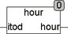

<!--
  Copyright (c) 2026 Hans Mühlbauer, Franz Höpfinger and others.

  This program and the accompanying materials are made available under the
  terms of the Eclipse Public License 2.0 which is available at
  https://www.eclipse.org/legal/epl-2.0

  SPDX-License-Identifier: EPL-2.0
-->

## Type	Function: INT

| | |
|:---|:---|
| **Input	ITOD** | TIMEOFDAY (day time) |
| **Output** | INT (current hour) |
| | The HOUR function extracts the current hour of the day. |



**Example:**

```iecst
HOUR(22:55:13) = 22
```
