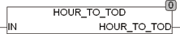

<!--
  Copyright (c) 2026 Hans Mühlbauer, Franz Höpfinger and others.

  This program and the accompanying materials are made available under the
  terms of the Eclipse Public License 2.0 which is available at
  https://www.eclipse.org/legal/epl-2.0

  SPDX-License-Identifier: EPL-2.0
-->

## Type	Function: TIME

| | |
|:---|:---|
| **Input	IN** | REAL (number of hours with decimals) |
| **Output** | TIME (days) |
| | The function HOUR_TO_TOD calculate a time of day (TIMEOFDAY) from the input value in hours as REAL. |



**Example:**

```iecst
HOUR_TO_TOD(12.1) = 12:06:00
```
