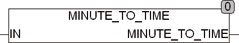

<!--
  Copyright (c) 2026 Hans Mühlbauer, Franz Höpfinger and others.

  This program and the accompanying materials are made available under the
  terms of the Eclipse Public License 2.0 which is available at
  https://www.eclipse.org/legal/epl-2.0

  SPDX-License-Identifier: EPL-2.0
-->

## Type	Function: TIME

| | |
|:---|:---|
| **Input	IN** | REAL (number of minutes with decimals) |
| **Output** | TIME (TIME) |
| | The function MINUTE_TO_TIME  calculates a time value (TIME) from the input in minutes as REAL. |



**Example:**

```iecst
MINUTE_TO_TIME(122.5) = T#2h2m30s
```
