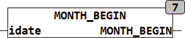

<!--
  Copyright (c) 2026 Hans Mühlbauer, Franz Höpfinger and others.

  This program and the accompanying materials are made available under the
  terms of the Eclipse Public License 2.0 which is available at
  https://www.eclipse.org/legal/epl-2.0

  SPDX-License-Identifier: EPL-2.0
-->

## MONTH_BEGIN

| | |
|:---|:---|
| **Type	Function** | DATE |
| **Input	IDATE** | DATE (current date) |
| **Output** | DATE (date of the 1st day of current month) |
| | MONTH_BEGIN calculates the date of first Day of the current month and current year. |
| | MONTH_BEGIN(D#2008-2-13) = D#2008-2-1 |

