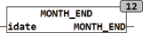

<!--
  Copyright (c) 2026 Hans Mühlbauer, Franz Höpfinger and others.

  This program and the accompanying materials are made available under the
  terms of the Eclipse Public License 2.0 which is available at
  https://www.eclipse.org/legal/epl-2.0

  SPDX-License-Identifier: EPL-2.0
-->

## MONTH_END

| | |
|:---|:---|
| **Type	Function** | DATE |
| **Input	IDATE** | DATE (current date) |
| **Output** | DATE (date of the last day of the current month) |
| | MONTH_END calculates the date of the last day of the current month and current year. |
| | MONTH_END(D#2008-2-13) = D#2008-2-29 |

