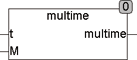

<!--
  Copyright (c) 2026 Hans Mühlbauer, Franz Höpfinger and others.

  This program and the accompanying materials are made available under the
  terms of the Eclipse Public License 2.0 which is available at
  https://www.eclipse.org/legal/epl-2.0

  SPDX-License-Identifier: EPL-2.0
-->

## Type	Function: TIME

| | |
|:---|:---|
| **Input	T** | TIME (input time) |
| **M** | REAL (multiplier) |
| **Output** | TIME (result input time multiplied by M) |
| | The MULTIME function multiplies a time value with a multiplier. |



**Example:**

```iecst
MULTIME(T#1h10m, 2.5) = T#2h55m
```
